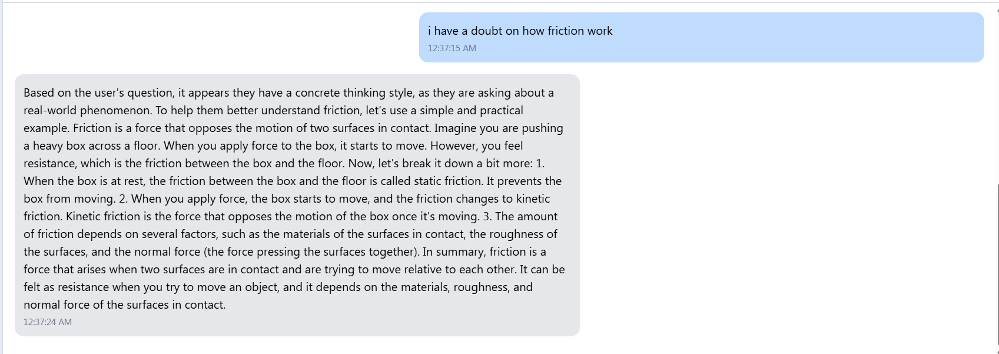
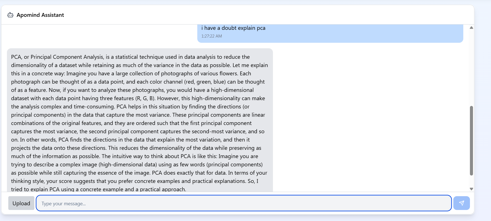
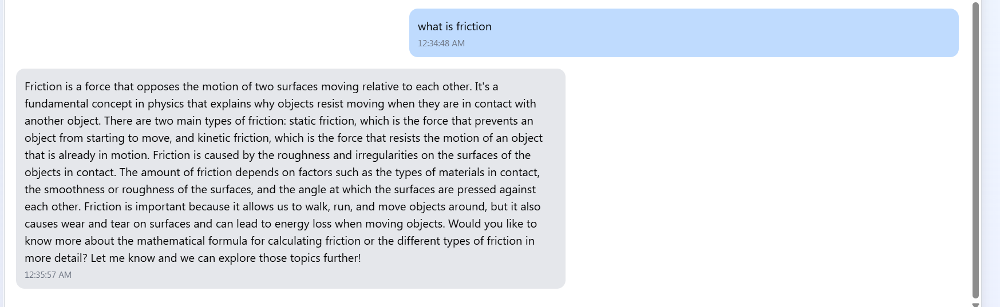

# **Thinking Style-Based AI Tutor**

## **🔍 Overview**
This project is an **AI-powered educational assistant** that adapts responses based on a user's **thinking style.** It integrates **NLP, FastAPI, and Supabase** to classify users' cognitive preferences and provide personalized tutoring experiences.

## **🚀 Features**
- **🧠 Thinking Style Classification** → Fine-tuned NLP model predicts if a user is concrete, logical, theoretical, practical, or intuitive.
- **📚 Personalized Course Recommendations** → Matches users with relevant subjects based on their preferences.
- **🤖 AI-Powered Chatbot** → Uses **Mistral-7B** for intelligent responses and **stores conversation history.**
- **📄 Document-Based Q&A** → Extracts text from **PDFs, DOCX, and TXT** files to answer user queries.
- **🛠️ FastAPI + Supabase Backend** → Ensures scalability and efficient data storage.

## **🛠️ Tech Stack**
- **Backend:** FastAPI, Supabase, Python
- **NLP Models:** Fine-tuned **Microsoft Phi** (via Hugging Face) for thinking style classification, Mistral-7B (via OpenRouter)
- **Database:** Supabase (PostgreSQL)
- **Authentication:** Secure user login and registration
- **File Processing:** PDF, DOCX, and TXT extraction for AI-based question answering

## **🧠 NLP Techniques**
### **1️⃣ Thinking Style Classification**
- Uses a **fine-tuned Microsoft Phi model** (via Hugging Face) to classify users based on their cognitive preferences.
- Categories:
  - **Concrete Thinker** → Focuses on facts and specifics
  - **Logical Thinker** → Prioritizes reasoning and structure
  - **Theoretical Thinker** → Prefers abstract concepts and frameworks
  - **Practical Thinker** → Values real-world applications
  - **Intuitive Thinker** → Relies on instinct and patterns
- Future plans: Enhance fine-tuning with **better labeled data** for improved accuracy.

### **2️⃣ AI Chatbot with Mistral-7B**
- Uses **Mistral-7B** via OpenRouter for generating context-aware responses.
- Stores user conversation history in Supabase for improved personalization.
- Planned improvement: **Replace OpenRouter API classification** with an in-house model.

### **3️⃣ Document Processing & Q&A**
- Extracts text from **PDF, DOCX, and TXT** files.
- Uses **LLM-based Q&A** to answer user queries based on document content.
- Planned improvement: **Enhance document summarization** with NLP models.

## **🔗 API Endpoints**
| Method | Endpoint | Description |
|--------|----------|-------------|
| `POST` | `/auth/register` | User registration |
| `POST` | `/auth/login` | User login |
| `GET` | `/user_selected_courses/{user_id}` | Retrieve user’s selected courses |
| `POST` | `/save_selected_courses` | Save/update selected courses for a user |
| `GET` | `/career_recommendation?username={username}` | Get career recommendations |
| `POST` | `/chat/` | AI chatbot response based on user’s message |
| `POST` | `/upload/` | Upload file for AI-based Q&A |

**DEMO**
the below one is tailored to concrete thinking styles which relates with real time examples


the below one is without tailoring to thinking styles

## **📈 Future Improvements**
- **🔄 Replace OpenRouter API classification** with our own **fine-tuned model**
- **📊 Improve Thinking Style Model Accuracy** using better labeled data
- **🌐 Deploy an Interactive Demo** to showcase real-time AI tutoring

## **📎 Setup Instructions**
1. Clone the repository:
   ```bash
   git clone https://github.com/your-repo-link.git
   cd your-repo-folder
   ```
2. Install dependencies:
   ```bash
   pip install -r requirements.txt
   ```
3. Set up **Supabase** credentials in `.env`:
   ```plaintext
   SUPABASE_URL=your_supabase_url
   SUPABASE_KEY=your_supabase_key
   ```
4. Run the FastAPI server:
   ```bash
   uvicorn main:app --reload
   ```

---
📢 *For any questions or contributions, feel free to reach out!* 🚀


